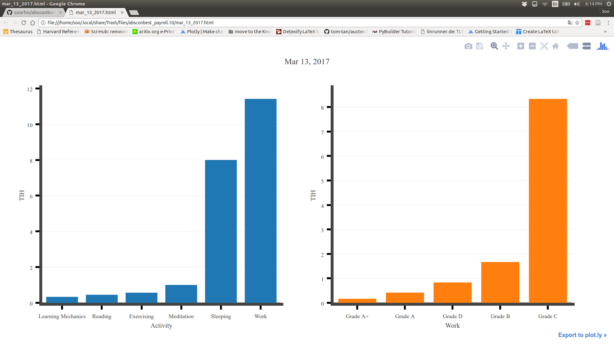
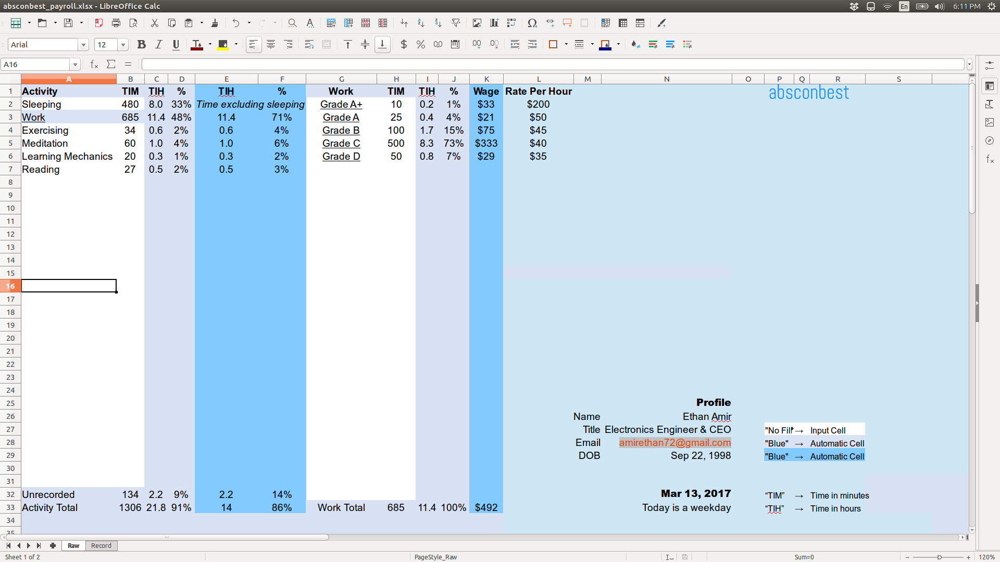

========================================================== 
Absconbest Payroll/Time Management |pyversion| |spacemacs| 
==========================================================

open source time/payroll management system including a spreadsheet working perfectly with both Excel and Calc; and *Python* functions like generating a graph and report; tested and worked well in Ubuntu 16.04 and Windows 10:

.. image:: pics/demo.gif

Installation
============

Ubuntu/Linux
------------

This program requires *Python* and its building tools which can be installed with a terminal:

>>> sudo apt update
>>> sudo apt install python-dev python-pip
>>> sudo -H pip install --upgrade pip wheel setuptools

Finally, install our package:

>>> sudo -H pip install absconbest-payroll

.. pip install .. --user does not install the command

Windows
-------

Install *Python*'s latest version `here
<https://www.python.org/downloads/>`_, and open a file explorer and double click:

  C:\\python27\\tools\\scripts\\win_add2path.py

Type:

  [ctrl] and [x]

  [a]

Now, install *Python*'s building tools:

>>> python -m pip install --upgrade pip wheel setuptools

Then, install our package:

>>> python -m pip install absconbest-payroll

Function Examples
=================

The *Python* function generates a graph and report. In *Ubuntu*, open a terminal and type the following command:

>>> absconbest

In *Windows*, run the exe file. By the way, we can move this into any folder like Desktop.

*Python 2*
  C:\\python27\\tools\\Scripts\\absconbest.exe

*Python 3*
  C:\\users\\AppData\\local\\Programs\\Python3*\\tools\\Scripts\\absconbest.exe

Generating a report does not work without installing *texLive*, which is `here
<https://www.tug.org/texlive/acquire-iso.html>`_.

 .. image:: pics/pylatex.png
   :target: https://github.com/JelteF/PyLaTeX

The graph and report are saved in:

  ~/Desktop/absconbest_payroll/output/

Moreover, the *absconbest_payroll* folder in Desktop has *absconbest_payroll.xlsx* which works well with both *Microsoft Excel* and *Libreoffice Calc*. In *Ubuntu*, we can open it with: 

>>> libreoffice ~/Desktop/absconbest_payroll/absconbest_payroll.xlsx

Contribution
============

Use and extend our package freely. All the *Python* functions and the spreadsheet are in: 

  .../*this repository*/absconbest_payroll/ 

Developing may become easier - for developers in Linux - by using the bash script *make*, which is in the repository's root. It builds the source code with *setuptools*, installs this built package with *pip*, and cleans up *.pyc* files, *.egg-info* folder, and other auto-generated auxiliaries.

>>> .../*this repository*/make

Ask me any question:

  soobinrho@gmail.com

Uninstallation
==============

Windows
-------

Type:

  [ctrl] and [x]

  [a]

Then, on the *cmd*:

>>> python -m pip uninstall absconbest-payroll -y

Finally, delete the *absconbest_payroll* folder in Desktop.

Ubuntu
------ 

>>> sudo -H pip uninstall absconbest-payroll -y
>>> rm -rf ~/Desktop/absconbest-payroll/

.. |spacemacs| image:: https://cdn.rawgit.com/syl20bnr/spacemacs/442d025779da2f62fc86c2082703697714db6514/assets/spacemacs-badge.svg
   :target: http://spacemacs.org

.. |license| image:: https://img.shields.io/github/license/soorho/absconbest-payroll.svg
   :target: https://github.com/soorho/absconbest-payroll/blob/master/license.txt

.. |pyversion| image:: https://img.shields.io/badge/python-2%2C%203-green.svg
   :target: https://www.python.org/downloads/                   
